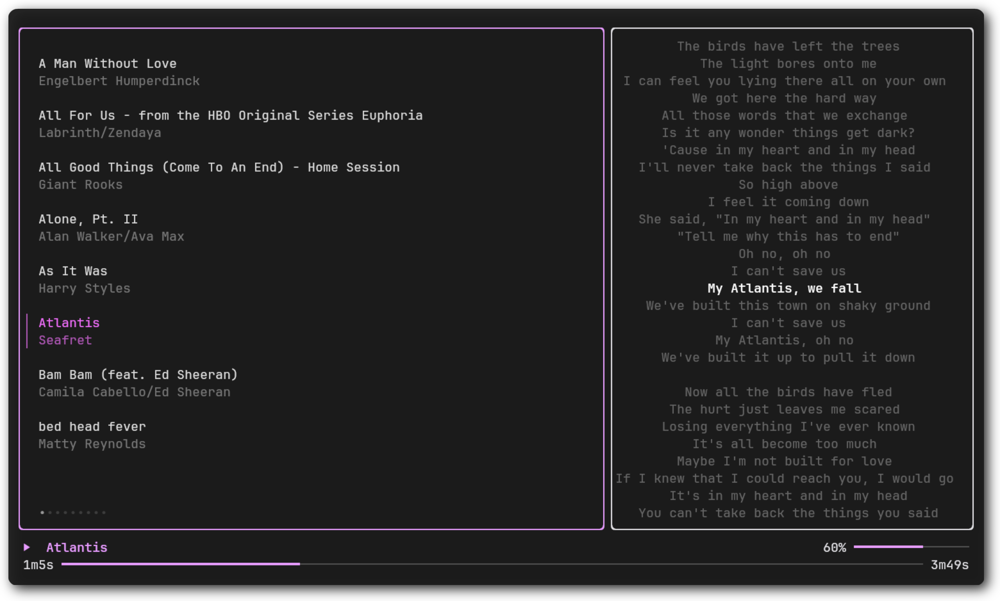

# Sonik 🎵

Sonik is a terminal-based music player (TUI) written in Go, leveraging the power of [Bubbletea](https://github.com/charmbracelet/bubbletea) and [Lipgloss](https://github.com/charmbracelet/lipgloss). It provides a sleek and interactive interface for managing and playing your music directly from the terminal.

\
*Screenshot of Sonik in action.*

## Features

- **Synced Lyrics**: Sonik pulls synced lyrics for your songs from the web.
- **Intuitive Navigation**: Use `j`, `k`, or arrow keys for smooth list navigation.
- **Search Functionality**: Quickly find songs using the `/` key (work in progress).
- **Playback Control**: Pause, play, seek, and adjust volume with easy-to-remember keybindings.
- **Stylish Interface**: Beautifully styled with [Lipgloss](https://github.com/charmbracelet/lipgloss) for a polished terminal experience.
- **Platform Agnostic**: Cross-compiled for Linux, Windows, and more.

## Keybindings 🎹

| Key                      | Action                          |
|--------------------------|----------------------------------|
| `j` / `↓`               | Move down the list              |
| `k` / `↑`               | Move up the list                |
| `h` / `←`               | Move left                       |
| `l` / `→`               | Move right                      |
| `/`                     | Search the list (in progress)   |
| `Shift + l` / `Shift + h`| Seek forward / backward         |
| `Space`                 | Toggle pause/play               |
| `<` / `>`               | Decrease / Increase volume      |
| `Enter`                 | Play the selected song          |
| `Ctrl + l` / `Ctrl + →` | Focus on the right view         |
| `Ctrl + h` / `Ctrl + ←` | Focus on the left view          |

## Installation ⚙️

1. **Clone the repository**:

   ```bash
   git clone https://github.com/HichamLamine/sonik.git
   cd sonik
   ```

1. **Build the project**:

   ```bash
   go build -o sonik main.go
   ```

1. **Run Sonik**:

   ```bash
   ./sonik
   ```

## Future Improvements 🌟

- Complete the search functionality.
- Enhance error handling and notifications.

## Contributing

Contributions are welcome! Feel free to submit issues or pull requests.

## License 📜

Sonik is licensed under the [MIT License](./LICENSE).

______________________________________________________________________

*Built with ❤️ and [Bubbletea](https://github.com/charmbracelet/bubbletea) + [Lipgloss](https://github.com/charmbracelet/lipgloss)*
